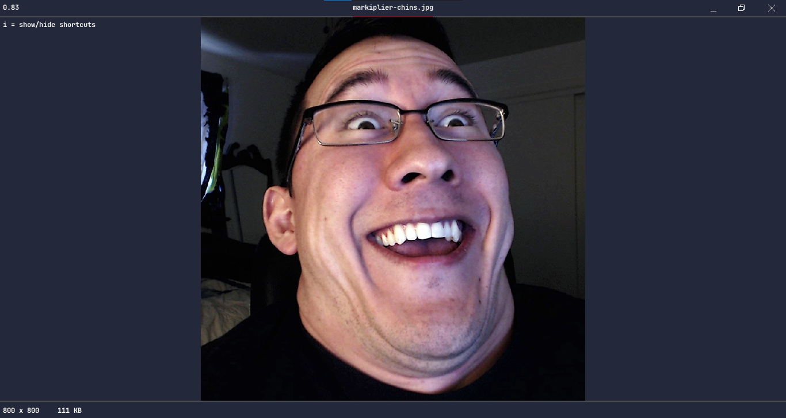

# Bloat-Free-Image-Viewer ~bfiv 
A CLI tool that loads an image file into a bloat-free gui viewer.

I absolute hate windows' proprietary image viewer. It's filled to the brim with bloat; features that literally nobody uses, and as a result the app runs slower than fucking molasses going uphill. And so begun a tale as old as time, the fabled David and Goliath; little man versus the big man; the cracked junior developer piercing into the souls of the soy Microsoft devs that made this hideous piece of software, and challenging them to a duel, a clash of ideals, so to speak, by making my own blazingly fast, bloat-free, OPEN SOURCE image viewer. 

I used c++ along with the raylib graphics library (openGL wrapper) to anyone curious. A note I feel is important: this image viewer is tailored to my preferences, so if you think it needs some other feature, feel free to make an issue if you care enough. 

## Features
- It loads images, duh-doy!
- Vim navigation for moving across the image when zoomed in.
- Displays necessary info such as:
	- Dimensions (pixels)
	- Size
	- File name + Full File Path

## Demo



## Build from Source
```
$ make gui
```

## Usage
- I recommend making a bash alias to 
```
$ bfiv "filename.file"
$ bfiv filename.file
$ bfiv ./filename.file
$ bfiv ./dir1/dir2/filename.file
$ bfiv ../../filename.file
```
